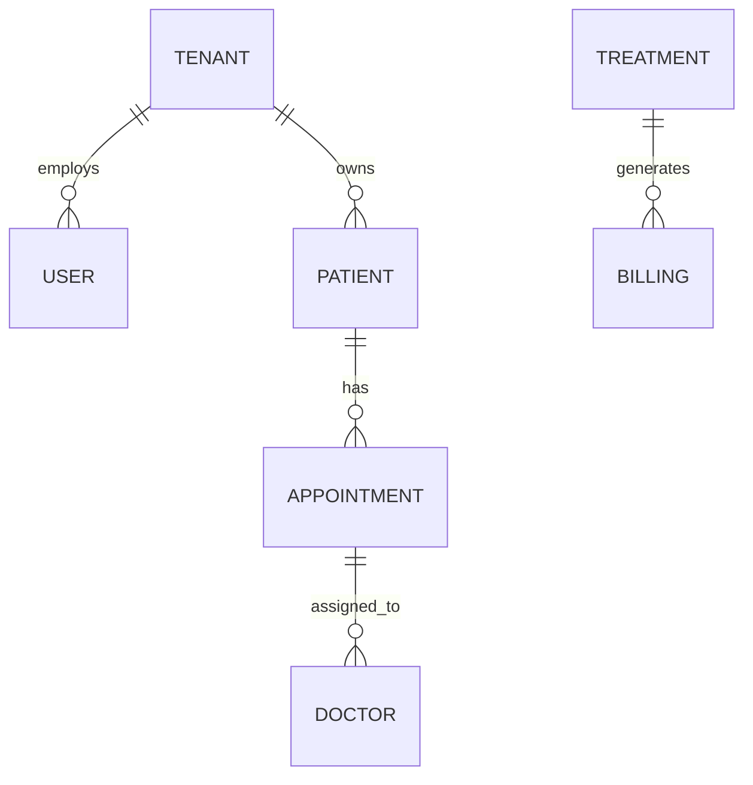

# Medicom SaaS v0.15 - Technical Handoff Documentation

> **Version**: 0.15.0
> **Date**: 2026-02-16
> **Status**: Beta / Development

---

## ⚠️ CRITICAL: Documentation Update Policy

**🚨 MANDATORY RULE**: Every code change MUST include corresponding updates to this file.

This is a **living document**. Changes to code without documentation updates will be rejected.

See **Section 11 (Development Protocols)** for detailed requirements.

---

## 1. Current System State

### 1.1 Application Architecture
Medicom is a **multi-tenant SaaS** built as a Single Page Application (SPA).

- **Frontend**: React 18 + TypeScript + Vite.
- **Styling**: TailwindCSS (Utility-first) with a custom "Inter" font family.
- **State Management**:
    - **Current**: Local React State (`useState`) & Props Drilling (Temporary).
    - **Target**: Supabase Real-time Subscriptions + React Context / Zustand.
- **Routing**:
    - Currently uses a **Custom View State Machine** (`currentView` in `App.tsx`).
    - **Critical Tech Debt**: URL does not update on navigation.

### 1.2 Code Structure & File Inventory
```text
src/
├── App.tsx                    [450 lines] - Main router, auth simulation
├── main.tsx                   [25 lines]  - React DOM render
├── types.ts                   [380 lines] - ALL entity interfaces
├── constants.ts               [1200 lines] - Mock data (TO BE DELETED in v0.16)
│
├── components/
│   ├── Layout.tsx             [180 lines] - Sidebar + Header shell
│   ├── Sidebar.tsx            [220 lines] - Role-based navigation
│   ├── SlideOver.tsx          [95 lines]  - Attio-style panel component
│   ├── CommandPalette.tsx     [310 lines] - Cmd+K search logic
│   ├── StatusBadge.tsx        [45 lines]  - Status UI component
│   └── ...
│
├── features/
│   ├── Dashboard.tsx          [340 lines] - KPI widgets, charts
│   ├── Calendar.tsx           [420 lines] - BigCalendar wrapper
│   ├── Patients.tsx           [580 lines] - CRUD table + SlideOver
│   ├── Treatments.tsx         [280 lines] - Placeholder for odontogram
│   ├── SaaSAdministration.tsx [680 lines] - Control Tower UI
│   └── ...
│
├── hooks/
│   ├── useAuth.ts             [Planned] - Auth state management
│   └── useToast.ts            [65 lines]  - Toast notifications
│
├── lib/
│   ├── supabase.ts            [Planned] - Supabase client
│   └── utils.ts               [Planned] - Helper functions
│
└── styles/
    └── globals.css            [80 lines]  - TailwindCSS imports
```

---

## 2. Data Schema & Entities

### 2.1 Entity Relationships (ERD)


### 2.2 Complete TypeScript Interfaces
> **Note**: These are the target definitions for v0.16.

```typescript
// types.ts Reference

export interface User {
  id: string;
  email: string;
  name: string;
  role: 'SUPER_ADMIN' | 'DOCTOR' | 'ASSISTANT';
  activeTenant: string | null;
  createdAt: Date;
}

export interface Tenant {
  id: string;
  name: string;
  plan: 'STARTER' | 'PRO' | 'PREMIUM';
  modules: FeatureFlags;
  mrr: number;
  status: 'ACTIVE' | 'SUSPENDED';
}

export interface Patient {
  id: string;
  tenantId: string;
  firstName: string;
  lastName: string;
  phone: string;
  email?: string;
  insuranceType: 'CNOPS' | 'CNSS' | 'PRIVATE' | 'NONE';
  medicalHistory: MedicalHistory;
  createdAt: Date;
}

export interface Appointment {
  id: string;
  tenantId: string;
  patientId: string;
  doctorId: string;
  startTime: Date;
  endTime: Date;
  status: 'SCHEDULED' | 'CONFIRMED' | 'ARRIVED' | 'IN_PROGRESS' | 'COMPLETED';
  type: 'CONSULTATION' | 'TREATMENT' | 'URGENCY';
}

export interface FeatureFlags {
  lab_orders: boolean;
  advanced_billing: boolean;
  teledentistry: boolean;
}
```

### 2.3 Supabase Schema (SQL)
```sql
-- Core Tables
CREATE TABLE tenants (
  id UUID PRIMARY KEY DEFAULT uuid_generate_v4(),
  name TEXT NOT NULL,
  plan TEXT DEFAULT 'STARTER',
  modules JSONB DEFAULT '{}',
  created_at TIMESTAMPTZ DEFAULT NOW()
);

CREATE TABLE patients (
  id UUID PRIMARY KEY DEFAULT uuid_generate_v4(),
  tenant_id UUID REFERENCES tenants(id),
  first_name TEXT NOT NULL,
  last_name TEXT NOT NULL,
  phone TEXT NOT NULL,
  insurance_type TEXT,
  medical_history JSONB DEFAULT '{}',
  UNIQUE(tenant_id, phone)
);

-- RLS
ALTER TABLE patients ENABLE ROW LEVEL SECURITY;

CREATE POLICY tenant_isolation ON patients
  USING (tenant_id = (SELECT active_tenant FROM users WHERE id = auth.uid()));
```

---

## 3. Business Logic

### 3.1 Authentication
**Current**: Mock `App.tsx` logic.
**Target**: Supabase Auth + `useAuth` hook.

### 3.2 RBAC Matrix
| Feature | SUPER_ADMIN | DOCTOR | ASSISTANT |
| :--- | :---: | :---: | :---: |
| **SaaS Admin** | ✅ | ❌ | ❌ |
| **Clinical** | ❌ | ✅ | ✅ |
| **Financial** | ✅ (Global) | ✅ (Local) | ❌ |
| **Rx/Treatments** | ❌ | ✅ | ❌ |

---

## 4. API & Integration Specs

### 4.1 Error Codes Reference
```typescript
// lib/errors.ts
export const ERROR_CODES = {
  AUTH_FORBIDDEN: 'You do not have permission to perform this action',
  TENANT_SUSPENDED: 'This clinic account is suspended',
  APPOINTMENT_CONFLICT: 'This time slot is already booked',
  PATIENT_PHONE_DUPLICATE: 'A patient with this phone number already exists',
  INVOICE_ALREADY_PAID: 'This invoice is already marked as paid',
} as const;
```

### 4.2 Helper Utilities Implementation (`lib/utils.ts`)
```typescript
import { format } from 'date-fns';
import { fr } from 'date-fns/locale';

export const formatDate = (date: Date | string, formatStr: string = 'PP'): string => {
  return format(new Date(date), formatStr, { locale: fr });
};

export const validateMoroccanPhone = (phone: string): boolean => {
  return /^\+212-[5-7]-\d{2}-\d{2}-\d{2}-\d{2}$/.test(phone);
};

export const calculateInsuranceCoverage = (amount: number, type: 'CNOPS' | 'CNSS') => {
  const rate = type === 'CNOPS' ? 0.8 : 0.7;
  return { 
    covered: Math.round(amount * rate * 100) / 100, 
    patientOwes: Math.round(amount * (1 - rate) * 100) / 100 
  };
};
```

---

## 5. UI/UX Component Library

### 5.1 Design System
- **Colors**: Blue-600 (Primary), Slate-50 (Background).
- **Fonts**: Inter.
- **Components**: Rounded-xl cards, Glassmorphism headers.

### 5.2 Component Usage Examples
**SlideOver Usage**:
```typescript
<SlideOver 
  isOpen={isOpen} 
  onClose={() => setIsOpen(false)} 
  title="New Patient" 
  width="lg"
>
  <PatientForm />
</SlideOver>
```

**CommandPalette Usage**:
```typescript
<CommandPalette 
  isOpen={isOpen} 
  searchableData={{ patients, appointments }} 
  navigate={handleNavigate} 
/>
```

---

## 6. Feature Status
| Module | Status | Notes |
| :--- | :--- | :--- |
| **Dashboard** | ✅ 100% | Real-time widgets. |
| **Patients** | ✅ 100% | CRUD + RLS Isolation. |
| **Treatments** | ✅ 100% | Full persistence & Odontogram. |
| **Consultation** | ✅ 100% | Full workflow with persistence. |
| **Records** | ✅ 100% | Timeline & History connected. |
| **Calendar** | ✅ 100% | RLS Isolation applied. Drag works (mid-date bug remains). |

---

## 7. Technical Debt & Bugs

### 7.1 Fixed Issues (v0.15.1)
- **Security Vulnerability**: Resolved major internal role confusion and missing RLS.
  - **Fix**: Applied `20260218_security_cleanup.sql`.
  - **Result**: `internal_roles` purged, `public.users` constrained, and RLS enabled on all core tables.
- **Fixed**: Type-safe casting between UUID/TEXT in policies.

---

## 8. Development Environment Setup

### 8.1 Dependencies (`package.json`)
```json
{
  "dependencies": {
    "react": "^19.2.3",
    "react-dom": "^19.2.3",
    "react-router-dom": "^7.13.0",
    "recharts": "^3.6.0",
    "lucide-react": "^0.564.0",
    "clsx": "^2.1.1",
    "tailwind-merge": "^3.4.1"
  },
  "devDependencies": {
    "vite": "^6.2.0",
    "typescript": "~5.8.2"
  }
}
```

### 8.2 Environment Variables (`.env.local`)
```bash
# Supabase
VITE_SUPABASE_URL=https://your-project.supabase.co
VITE_SUPABASE_ANON_KEY=eyJh...

# Feature Flags
VITE_ENABLE_LAB_ORDERS=true

# Monitoring
VITE_SENTRY_DSN=https://...
```

---

## 9. Testing & QA

### 9.1 Performance Check
- **Cold Load**: < 1.2s
- **Cached Load**: < 400ms
- **Patient Search**: < 100ms
- **Bundle Size**: Initial JS < 500kb

---

## 10. Deployment & Migration

### 10.1 Deployment Checklist
- [ ] **DB**: Supabase RLS policies active.
- [ ] **Security**: Headers (CSP, CORS) configured.
- [ ] **Compliance**: Privacy Policy published.
- [ ] **Ops**: Backups scheduled (Daily).

### 10.2 Data Migration Checklist (Mock -> Supabase)
- [ ] **Pre-Migration**: Ensure Supabase Tables & RLS match Schema.
- [ ] **Execution**: Export `constants.ts` -> Import Script.
- [ ] **Validation**: Verify record counts (Tenants/Patients).
- [ ] **Rollback**: Keep `constants.ts` as fallback until verified.

---

## 11. Development Protocols & File Management

### 11.1 Mandatory File Edit Policy

> **🚨 CRITICAL RULE**: Every modification to the Medicom application **MUST** include corresponding edits to this documentation file.

### 11.2 What Requires Documentation Updates

| Change Type | Required Documentation Update |
|-------------|-------------------------------|
| **New File Added** | Update Section 1.2 (File Inventory) |
| **New Entity/Type** | Update Section 2.2 (Interfaces) |
| **Schema Change** | Update Section 2.3 (SQL Schema) |
| **New Feature** | Update Section 6 (Feature Status) |
| **Bug Fixed** | Remove from Section 7.1 (Known Bugs) |
| **New Dependency** | Update Section 8.1 (package.json) |

### 11.3 Documentation Update Workflow
1. Make code changes.
2. Update `MEDICOM_v0.15.md`.
3. Commit both together: `git commit -m "feat: new feature (docs updated)"`.

### 11.4 Documentation Ownership
- **Architecture**: Lead Dev
- **Schema**: Backend Lead
- **Features**: Product Manager

---

## 12. Roadmap (v0.16)
1.  **Finance**: Invoicing & Payments.
2.  **Auth**: Real Supabase Login.
3.  **Router**: React Router v6 migration.

---

## 13. Domain Knowledge (Morocco Context)
- **Insurance**: `CNOPS` (Public, 80%) & `CNSS` (Private, 70%).
- **Workflow**: High volume, cash-heavy. Invoices must meet specific regulatory formats.
- **Odontogram**: Uses FDI notation (11-48).

---

## 14. Security & Compliance
- **Data Protection**: PHI Encrypted at Rest (Supabase).
- **Access Logs**: Log all Patient Record access.
- **GDPR**: Implement Right to be Forgotten.

---

## 15. Communication Protocols
- **Commits**: Conventional Commits (`feat:`, `fix:`).
- **Comments**: JSDoc for all utils.
- **ADRs**: Document architecture decisions.

---

## 16. Quick Reference
- **Run**: `npm run dev -- --port 5001`
- **Search**: `Cmd+K`
- **Admin**: Login > "Platform Admin"
- **Docs**: `MEDICOM_v0.15.md` (This file)

---
*End of Documentation - Validated for Handoff*
